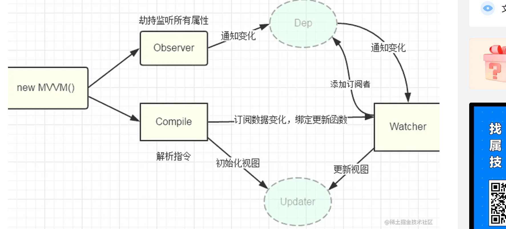

:

  首先将该任务分成几个子任务：

　　 1、输入框以及文本节点与 data 中的数据绑定

　　 2、输入框内容变化时，data 中的数据同步变化。即 view => model 的变化。

　　 3、data 中的数据变化时，文本节点的内容同步变化。即 model => view 的变化。

要实现任务一，需要对 DOM 进行编译，这里有一个知识点：DocumentFragment。
**DocumentFragment（文档片段）可以看作节点容器，它可以包含多个子节点，当我们将它插入到 DOM 中时，只有它的子节点会插入目标节点，所以把它看作一组节点的容器。使用 DocumentFragment 处理节点，速度和性能远远优于直接操作 DOM。Vue 进行编译时，就是将挂载目标的所有子节点劫持（真的是劫持，通过 append 方法，DOM 中的节点会被自动删除）到 DocumentFragment 中，经过一番处理后，再将 DocumentFragment 整体返回插入挂载目标。**